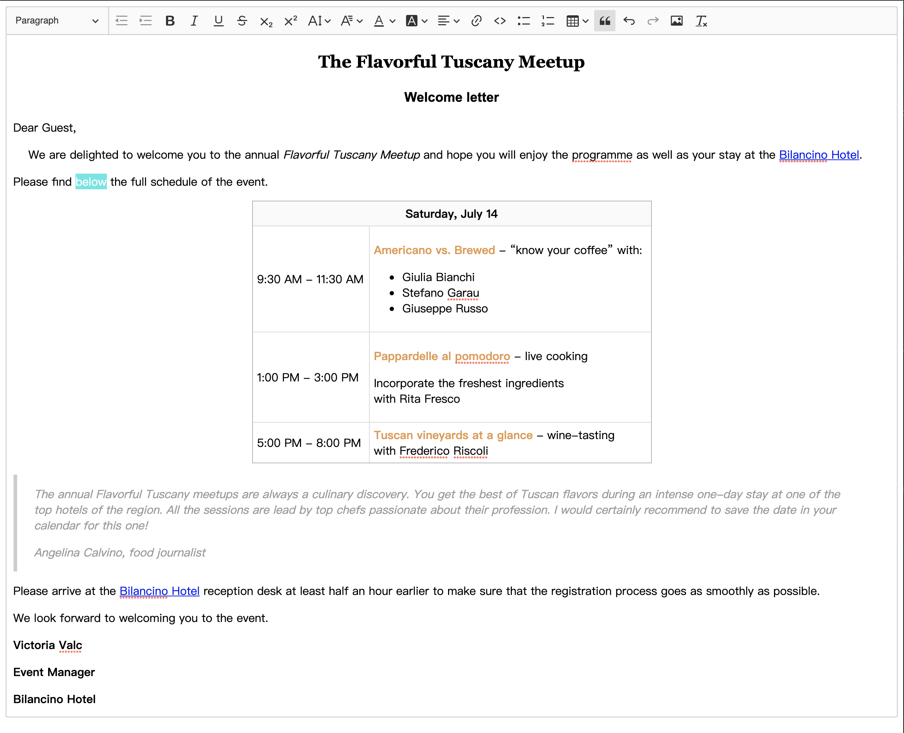

# react-ckeditor-classic


[](https://coveralls.io/github/ZekeXu/react-ckeditor-classic?branch=master)
[](https://circleci.com/gh/ZekeXu/react-ckeditor-classic/tree/master)

react-ckeditor-classic



## 1. Usage

```bash
yarn add react-ckeditor-classic
```

```jsx
import ReactEditor from 'react-ckeditor-classic';

<ReactEditor
  data='Hello Editor!'
  config={{uploadUrl: '/your/api/image/upload/url'}}
  onChange={(data, editor, event) => console.log(data, editor, event)}
/>
```

## 2. PublishLog

```v1.1.0``` 20180914

feature: format onChange parameters

```v1.0.0``` 20180913

feat: Publish first version

## 3. Custom defination

### (1). Webpack configuration

> If you use Webpack, you should config ```webpack.config.js```

```js

const {
  styles
} = require('@ckeditor/ckeditor5-dev-utils');

module: {
  rules: [
    {
      oneOf: [
          {
            test: /ckeditor5-[^/\\]+[/\\]theme[/\\]icons[/\\][^/\\]+\.svg$/,
            use: ['raw-loader']
          },
          {
            test: /ckeditor5-[^/\\]+[/\\]theme[/\\].+\.css/,
            use: [
              {
                loader: 'style-loader',
                options: {
                  singleton: true
                }
              },
              {
                loader: 'postcss-loader',
                options: styles.getPostCssConfig({
                  themeImporter: {
                    themePath: require.resolve('@ckeditor/ckeditor5-theme-lark')
                  },
                  minify: true
                })
              }
            ]
          },
          {
            exclude: [
              /\.js$/,
              /\.html$/,
              /\.json$/,
              /ckeditor5-[^/\\]+[/\\]theme[/\\]icons[/\\][^/\\]+\.svg$/,
              /ckeditor5-[^/\\]+[/\\]theme[/\\].+\.css/,
            ],
            loader: 'file-loader',
            options: {
              name: 'assets/[name].[hash:8].[ext]'
            }
          }
      ]
    }
  ]
}

```

### recommend plugin

> If you build for production you maybe should use [terser-webpack-plugin](https://github.com/webpack-contrib/terser-webpack-plugin) not [uglifyjs-webpack-plugin](https://github.com/webpack-contrib/uglifyjs-webpack-plugin)
Because ```terser-webpack-plugin``` support ES6.

For example

```js
optimization: {
    minimizer: [
      new TerserPlugin({
        sourceMap: useSourceMap,
        cache: true,
        parallel: true,
        terserOptions: {
          output: {
            ascii_only: true,
            comments: false
          },
          ecma: 8,
          compress: {
            comparisons: false
          }
        }
      }),
    ]
  },
```

## 3. LICENSE [LGPL-3.0](./LICENSE)
